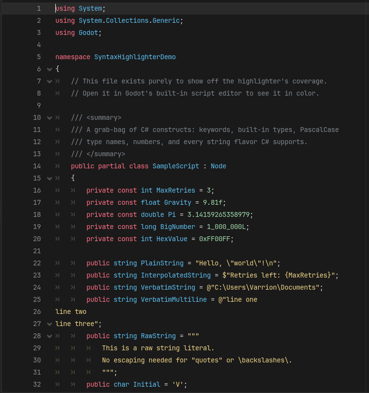

# C# Syntax Highlighter for Godot

Godot's built-in script editor doesn't ship with real syntax highlighting for
C# — `.cs` files open in mostly one color. This addon fixes that with a
lightweight, dependency-free tokenizer that colors keywords, types, strings,
numbers, and comments, right inside Godot's own editor.

## Features

- Keywords (`if`, `class`, `async`, `readonly`, contextual keywords like
  `get`/`set`/`where`, LINQ keywords, etc.)
- Built-in types (`int`, `string`, `bool`, `var`, ...) and a PascalCase
  heuristic that colors likely user-defined type names distinctly from plain
  identifiers
- All C# string flavors: regular `"..."`, char `'.'`, interpolated `$"..."`,
  verbatim `@"..."` (including multi-line), and raw `"""..."""` string
  literals (including multi-line)
- Line (`//`) and block (`/* */`) comments, with block comments correctly
  spanning multiple lines
- Numbers, including hex, underscore separators, and type suffixes (`0xFF`,
  `1_000_000L`, `9.81f`)
- `#preprocessor` directives

It's a single-pass lexer in the spirit of a TextMate grammar — not a full C#
parser. There's no semantic analysis (no Roslyn), so it can't resolve `var`
types or distinguish a type name from a namespace. See [Limitations](#limitations)
below.

## Installation

1. Copy the `addons/csharp_syntax_highlighter/` folder into your project's
   `addons/` directory.
2. In Godot, go to **Project → Project Settings → Plugins** and enable
   **C# Syntax Highlighter**.
3. Open (or reopen) a `.cs` file in the built-in script editor.

If a `.cs` file was already open in a tab *before* you enabled the plugin,
Godot won't retroactively apply the new highlighter to that tab — close and
reopen it, or restart the editor. See [Limitations](#limitations).

This only affects Godot's **built-in** script editor. If your Editor Settings
have an external editor configured for C# (VS Code, Rider, Visual Studio),
`.cs` files open there instead and this addon has no effect.

## Demo

This repository is itself a minimal Godot project. Open it in Godot 4.7+
(Mono/.NET build) and open [`demo/SampleScript.cs`](demo/SampleScript.cs) in
the script editor to see the highlighter running on a file that exercises
every construct it supports.

## Limitations

- No semantic highlighting — type names are guessed by PascalCase
  convention, not resolved against your actual class/namespace declarations.
- `[Attribute]` brackets aren't specially colored, to avoid false positives
  on array indexing (`arr[i]`).
- Expressions inside interpolated strings (`$"{expr}"`) aren't separately
  tokenized — the whole string stays string-colored.
- Per Godot's `EditorSyntaxHighlighter` API, registering the highlighter
  does not retroactively apply to scripts already open in a tab.

## License

[MIT](LICENSE)
